# Compiler

## Introduction

Tiny compiler, compiles C-syntax based code with pure written data structures.

 

## Process

### input

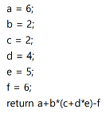

 

### parse variables and its initialized value with delimiters and `return` syntax

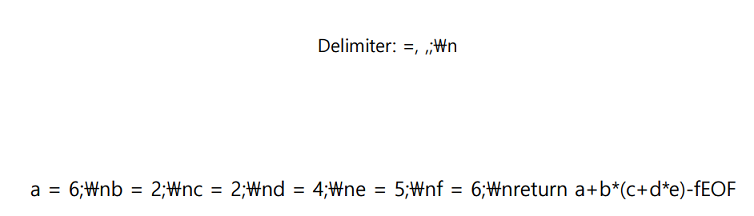

 

### Set **Non collision** hash table with **key** for _variable's name_ and **value** for _its value_

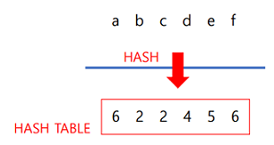

 
   
### Set infix return expression to postfix expression, then create expression tree.   
   
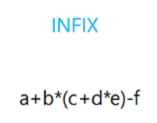 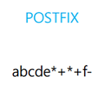   
   
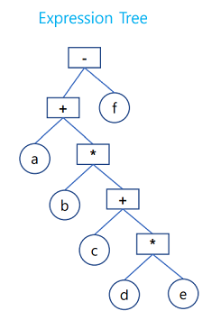   
   
 
   
### compile to assembly code with assembly generator with expression tree
   
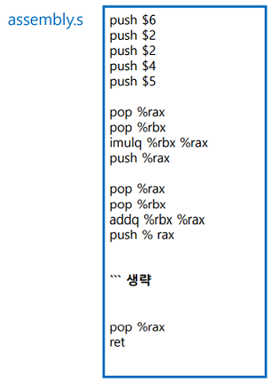   
   
 
   
### process will return its calculated value to OS
   
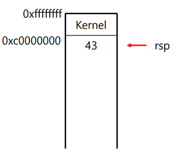 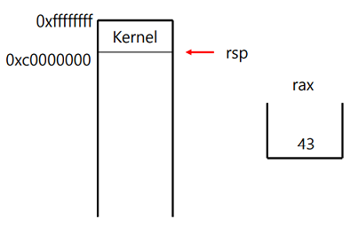
   
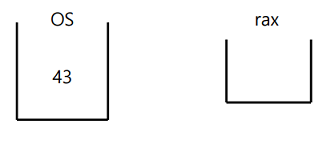   
   
 
   
### verify return value with `echo $?` command
   
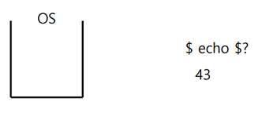
   
 
   
## Run
`$ compiler <code> <execute file name>`
